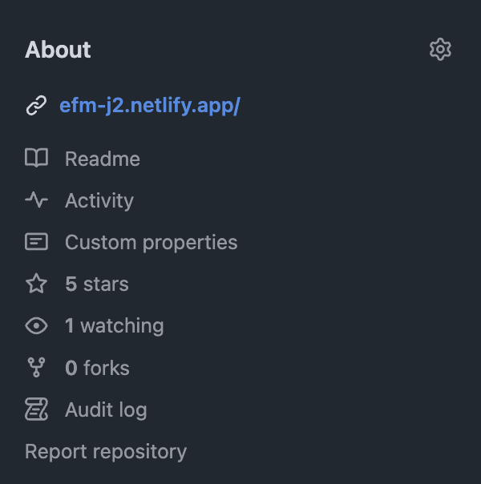

# Quality assurance

Tijdens deze sprint zorgen jullie ervoor dat de repository van jullie project op FDND Agency overzichtelijk, compleet en overdraagbaar is. Een nieuw team kan dan in de volgende fase het project probleemloos oppakken.

1. [Workflow](#workflow)
2. [Documentatie](#documentatie)
3. [Code/Design](#codedesign)

## Workflow

### Project board
- Zorg dat alle stories correct zijn geprioriteerd, afgerond en gedocumenteerd.
- Markeer alle resterende stories als "Done" of geef een duidelijke status (bijv. "Won't Fix" met uitleg).

M.a.w. er staan geen taken meer open na deze sprint ⚠️

### Branch management
- Zorg dat alle relevante branches worden samengevoegd in de dev branch. 
- Verwijder oude, ongebruikte branches om de repository schoon te houden. Alleen de main en dev blijven staan (dit zijn zogenaamde evergreen branches)
- Maak een `release-candidate` branch vanaf dev, dit gebeurt aan het einde van de sprint en leggen we verder uit in sprint 18. 
 
### Code reviews
- Voer een laatste teamcode-review uit om consistentie, leesbaarheid en kwaliteit te waarborgen.
- Documenteer eventuele uitzonderingen of keuzes in de codebase.

### Code structuur
- Zorg ervoor dat je een uniforme manier van het structureren van je code gebruikt (denk aan components)

### Deployment
Zorg dat de toepassing live staat op een platform zoals Netlify, Vercel, of een eigen server (FDND Netlify). Test de live versie grondig en zorg dat deze overeenkomt met de verwachtingen van de opdrachtgever.

## Documentatie

Een goede documentatie is cruciaal voor de overdraagbaarheid van het project. Controleer en/of maak de volgende onderdelen:

- [About sectie](#about-sectie)
- [README.md](#readmemd)
- [CONTRIBUTING.md](#contributingmd)
- [HANDOVER.md](#handovermd)
- [Technische documentatie](#technische-documentatie)

### About sectie

Dit is de about section in Github:

   - Zorg voor een korte beschrijving van het project.
   - Zorg voor een link naar de live site.

### README.md
- Een duidelijke beschrijving van het project.
- Gebruikte technieken (Tip: [shields](https://shields.io/))
- Installatie-instructies.
- Gebruikershandleiding.
- Link naar de live versie (indien beschikbaar).
- Voeg een changelog toe waarin alle belangrijke wijzigingen worden vermeld.
- Voeg links naar gerelateerde documentatie (bijv. `CONTRIBUTING.md`, `HANDOVER.md` en technische documentatie) toe aan de taken waar nodig.
- **Teamleden:** Voeg de namen van de huidige teamleden en hun rol toe, en link naar de GitHub profiles van de teamleden ⚠️ 

### CONTRIBUTING.md
Check of `CONTRIBUTING.md` up to date is en de onderstaande richtlijnen bevat:
- Hoe worden nieuwe branches aangemaakt (bijv. `feature/[naam]`).
- Hoe worden commits gemaakt (bijv. “Gebruik duidelijke commitberichten in de vorm van: [type]: [beschrijving]”).
- Hoe worden pull requests aangemaakt en gereviewd.
- Code conventies
- Definitions of ready & done

### HANDOVER.md
Schrijf een korte samenvatting in de repository (bijv. `HANDOVER.md`) waarin jullie het project introduceren aan de volgende groep:
- Wat is de huidige status van het project?
- Wat zijn de belangrijkste features die al werken?
- Wat zijn de grootste aandachtspunten of uitdagingen?
- Wat wordt aangeraden als eerste stap voor het volgende team?

### Technische documentatie
Voeg een aparte map `docs/` toe voor technische documentatie:
- Uitleg over hoe de code is gestructureerd.
- Datamodel (tip: [mermaid](https://mermaid.live/edit))
- Beschrijving van belangrijke componenten en hoe ze werken.
- Configuratie van het CMS: Welke contenttypes zijn er, hoe zijn ze ingesteld, en hoe werkt de koppeling met de front-end?
- Eventuele API-documentatie als er externe API’s worden gebruikt.
- Zorg voor een goede example.env en draag bestaande variables over via een bericht aan Joost

## CODE/DESIGN

### Code kwaliteit:
- Zorg dat de code voldoet aan de afgesproken code conventies.
- Verwijder overbodige of ongebruikte code.
- Optimaliseer de code waar mogelijk (bijv. DRY).
- Verwijder ongebruikte bestanden en mappen uit de repository.
- Controleer op testbestanden, tijdelijke bestanden (zoals `.DS_Store` of `node_modules`, als ze per ongeluk zijn gepusht) en verwijder deze.
- Controleer of alle bestanden en mappen logisch geordend zijn en duidelijke namen hebben.

### Responsiveness:
Controleer of de toepassing goed werkt op verschillende schermformaten (mobiel, tablet, desktop). Pas eventuele inconsistenties in het design aan.

### Toegankelijkheid (a11y):
- Controleer of de toepassing voldoet aan WCAG-richtlijnen.
- Test de toepassing met een screenreader en zorg dat alle interactieve elementen toegankelijk zijn.
- Controleer of je goed rekening houd met preferences van de gebruiker.

### Performance optimalisatie:
Controleer op laadtijden en optimaliseer afbeeldingen en assets. Test de toepassing met tools zoals Lighthouse om performance en toegankelijkheid te verbeteren.

### Progressive Enhancement
Controleer op verouderde browsers en browserversies. Test met verouderde devices (bijvoorbeeld uit het device lab).

### Complexe interacties:
- Zorg dat interactieve elementen (bijv. formulieren, animaties, drag-and-drop functionaliteit) intuïtief en foutloos werken.
- Check of alle mogelijke states geïmplementeerd zijn.
- Test edge cases en zorg dat er duidelijke foutmeldingen zijn waar nodig.

### Design consistentie:
- Controleer of alle componenten consistent zijn qua stijl en gedrag.
- Zorg dat het kleurgebruik, typografie en spacing overeenkomen met het ontwerp.
- Check of CSS states in de huisstijl zijn vormgegeven (bijv. focus-visible)

### Versiebeheer van assets:
Zorg dat alle afbeeldingen, iconen en andere assets goed georganiseerd zijn in de repository. Verwijder ongebruikte assets.

### Feedback aan de gebruiker:
Zorg dat er duidelijke feedback is voor gebruikers als er interactie is met de website (bijv. bij filteren of posten van content).

### Overdraagbaarheid:
Zorg dat de code en structuur begrijpelijk zijn voor een nieuwe ontwikkelaar. Voeg inline comments toe waar nodig om complexe logica uit te leggen.

### Betekenisvolle content:
Verwijder alle dummy content en zorg voor betekenivolle content waar nodig (content first!) Controleer alle interface copy (labels, buttons, links etc)
