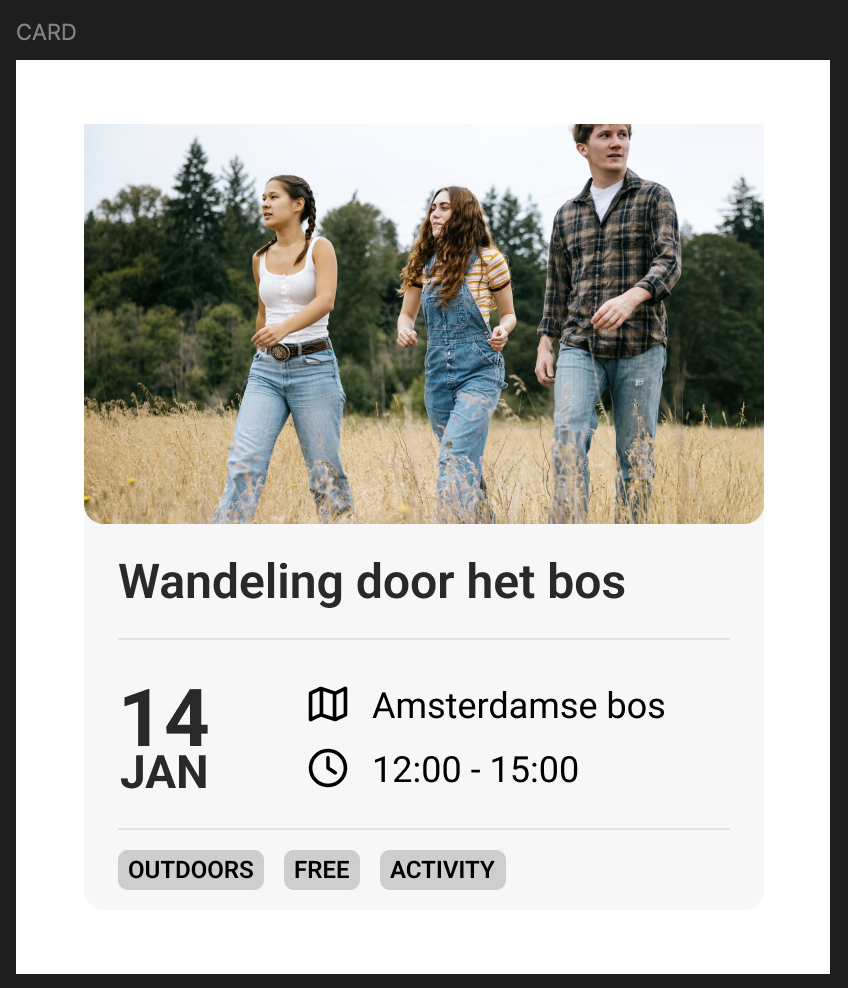

# Opdracht: Feature request 

## Stap 1: Offerte
1. Maak een ureninschatting op basis van het [ontwerp](https://www.figma.com/design/gP0sU7Gh3qUHKX5juBf9Hk/HVA---exercise?node-id=0-1&t=SMbCMJztbrf1DggX-1).
2. Ureninschatting x €60 is je offerte bedrag
3. Zet de uren en het bedrag op het bord onder je naam

## Stap 2: Bouwen
Ga bouwen! 

## Stap 3: Oplevering
Laat het aan een docent zien, die zal het vergelijken met het ontwerp. Zijn er feedback punten, hop opnieuw aan het werk.

Is het echt klaar? Stop de timer! Zet het aantal gemaakte uren onder je inschatting en vermenigvuldig met €60. Heb je winst of verlies gedraaid?

## Bronnen

- [KVK](https://www.kvk.nl/)
- [Kleine ondernemersregeling](https://www.belastingdienst.nl/wps/wcm/connect/bldcontentnl/belastingdienst/zakelijk/btw/hoe_werkt_de_btw/kleineondernemersregeling/kleineondernemersregeling)
- [Dutch digital agencies](https://dutchdigitalagencies.com/)
- Modelovereenkomsten freelance, [Belastingdienst](https://www.belastingdienst.nl/wps/wcm/connect/bldcontentnl/belastingdienst/zakelijk/ondernemen/modelovereenkomsten-in-plaats-van-var/modelovereenkomst-zoeken/algemene-modelovereenkomsten-downloaden)
- 
